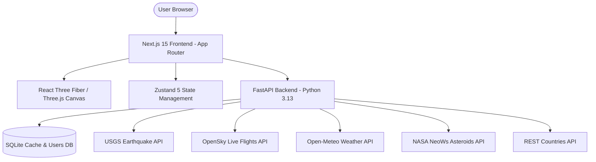

# 🌐 GlobeScope — Interactive 3D Geospatial Intelligence Platform


**GlobeScope** is a high-performance, real-time 3D Earth visualization platform built with **Next.js 15**, **React Three Fiber (R3F)**, and **FastAPI**. It renders dynamic global datasets — including live seismic activity, airborne flights, global weather metrics, political borders, and near-Earth asteroids — using hardware-accelerated GPU instancing and custom GLSL shaders.

---

## ✨ Features

- **🌐 Photorealistic 3D Earth & Atmosphere**:
  - **Dynamic Sun Terminator**: Real-time astronomical day/night boundary with soft atmospheric twilight gradients and golden dusk scattering.
  - **Surface Map Modes**: Seamless toggling between **Day Map**, **Night City Lights**, **Dynamic Real-time Day/Night**, and **Political Map Mode**.
  - **Custom GLSL Shader**: Performs single-pass GPU blending without extra light passes, ensuring locked 60 FPS performance.

- **📊 Real-Time Data Layers**:
  - 🌋 **Earthquakes**: 3D magnitude-scaled surface columns color-coded by focal depth (Shallow/Medium/Deep) powered by USGS.
  - ✈️ **Live Flights**: 3D airplane meshes positioned in 3D airspace with realistic altitude offset, heading rotation, and flight metadata powered by OpenSky Network.
  - 🌡️ **Global Weather**: Temperature, wind speed, and humidity indicators across 177 world capitals powered by Open-Meteo.
  - ☄️ **Near-Earth Objects (NEOs)**: Real-time 3D asteroid orbital trajectories around Earth powered by NASA NeoWs.
  - 🏛️ **Political Map & Capitals**: Vector country borders and 16-segment tapered 3D architectural pins marking world capitals.

- **🎨 Cockpit UI & User Features**:
  - **Glassmorphic UI Overlay**: Integrated drawer panels (`LayerPanel`, `DetailPanel`) built with Framer Motion and Lucide icons.
  - **Saved Globe Views**: Registered users can save custom combinations of active data layers and camera viewports to their personal account.
  - **JWT Authentication**: Secure user registration and login backed by direct `bcrypt` hashing and OAuth2 Bearer tokens.

---

## 🏗️ Architecture Overview



---

## 🚀 Quick Start

### Prerequisites
- **Node.js**: `v18.0.0` or higher
- **Python**: `v3.10` or higher

### 1. Clone & Setup Backend
```bash
cd backend
python -m venv venv
# On Windows:
venv\Scripts\activate
# On macOS/Linux:
# source venv/bin/activate

pip install -r requirements.txt
uvicorn app.main:app --reload --port 8000
```
Backend will start at `http://localhost:8000` (API Docs at `http://localhost:8000/docs`).

### 2. Setup Frontend
```bash
cd frontend
npm install
npm run dev
```
Frontend will start at `http://localhost:3000`.

---

## 🛠️ Technology Stack

| Layer | Technologies |
| :--- | :--- |
| **Frontend** | Next.js 15, React 19, React Three Fiber, Three.js, Drei, Zustand 5, Framer Motion, Lucide React |
| **Styling** | Vanilla CSS Glassmorphic Design System, CSS Variables, Responsive Layouts |
| **Backend** | Python 3.13, FastAPI, SQLAlchemy ORM, SQLite 3, PyJWT, Bcrypt, HTTPX Async Client |
| **APIs Integrated** | USGS Earthquake API, OpenSky Network, Open-Meteo, NASA NeoWs, REST Countries |

---

## 📁 Repository Structure

```
GlobeScope/
├── backend/
│   ├── app/
│   │   ├── main.py             # FastAPI Application & Router Mounting
│   │   ├── database.py         # SQLAlchemy Engine & Session Setup
│   │   ├── models.py           # SQLite Database Models (User, SavedView, CacheEntry)
│   │   ├── schemas.py          # Pydantic Request/Response Models
│   │   ├── auth_utils.py       # Bcrypt Hashing & JWT Token Generation
│   │   └── routers/            # API Route Handlers (auth.py, layers.py, views.py)
│   ├── requirements.txt        # Python Dependencies
│   └── README.md               # Backend Specific Documentation
│
├── frontend/
│   ├── src/
│   │   ├── app/                # Next.js App Router (page.js, layout.js, globals.css)
│   │   ├── components/
│   │   │   ├── globe/          # R3F Canvas, Earth Shader, Atmosphere, PostProcessing
│   │   │   ├── layers/         # Instanced 3D Layers (Earthquake, Flight, Weather, NEO, Capitals)
│   │   │   └── ui/             # Cockpit UI Overlays (Navbar, LayerPanel, DetailPanel, Modals)
│   │   ├── hooks/              # Custom Hooks (useLayerData.js, useGeoConvert.js)
│   │   └── store/              # Zustand State Management (useStore.js)
│   ├── package.json            # Node Dependencies
│   └── README.md               # Frontend Specific Documentation
│
```
