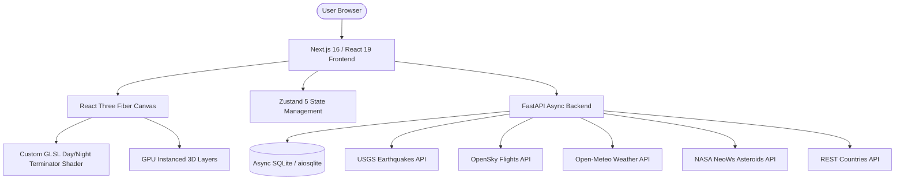

# 🌐 TerraScope — Interactive 3D Geospatial Intelligence Platform

<div align="center">

[](https://nextjs.org/)
[](https://react.dev/)
[](https://threejs.org/)
[](https://fastapi.tiangolo.com/)
[](https://www.sqlalchemy.org/)
[](https://www.docker.com/)

[**English**](#english-version) | [**Українська**](#українська-версія)

</div>

---

<a name="english-version"></a>
## 🇬🇧 English Version

### 📖 Overview

**TerraScope** is a real-time, hardware-accelerated 3D planetary visualization and geospatial intelligence platform. Engineered with **Next.js 16 (React 19)**, **React Three Fiber (R3F)**, **Three.js**, and an async **FastAPI** backend with **SQLAlchemy 2.0 (aiosqlite)**, TerraScope enables users to explore live global phenomena across multiple interactive 3D layers with locked 60 FPS performance.

---

### ✨ Key Features

- **🌐 Photorealistic 3D Earth & Custom GLSL Shaders**:
  - **Dynamic Sun Terminator**: Astronomical day/night computation in real-time with golden twilight atmospheric scattering in a single shader pass.
  - **4 Surface Modes**: Seamless switching between *Daytime Satellite*, *Night City Lights*, *Dynamic Day/Night*, and *Political Borders*.
  - **Atmospheric Glow**: Soft Fresnel outer glow and starfield background.

- **📊 Hardware-Accelerated Data Layers (GPU Instancing)**:
  - 🌋 **Earthquakes**: 3D extruded seismic columns scaled by magnitude ($M_w$) and color-coded by focal depth (Shallow, Medium, Deep) via USGS GeoJSON API.
  - ✈️ **Live Flights**: 3D airplane sprites oriented in real-time along flight headings with realistic altitude offsets via OpenSky Network API.
  - 🌡️ **Global Weather**: Live temperatures, wind speeds, and weather conditions across 70 world capitals via Open-Meteo API.
  - ☄️ **Near-Earth Objects (NEOs)**: 3D orbiting asteroids with interactive hover-freeze trajectories via NASA NeoWs API.
  - 🏛️ **Political Map & Capitals**: Vector country borders and 3D architectural markers for world capitals.

- **⚡ High-Concurrency Async Backend**:
  - **Cache Stampede Prevention**: `asyncio.Lock` per cache key ensures external APIs are queried at most once per TTL window during traffic spikes.
  - **Resilient Fallbacks**: 100% offline availability with curated emergency fallback datasets.
  - **Security & Rate Limiting**: SlowAPI rate limiting, `X-Request-ID` transaction tracking, and Bcrypt + OAuth2 JWT authentication.
  - **User Presets**: Authenticated users can save custom globe camera angles and active layer presets.

---

### 🏗️ Architecture



---

### 🚀 Quick Start with Docker Compose

```bash
# Clone repository and launch complete stack
docker compose up --build
```
- **Frontend**: `http://localhost:3000`
- **Backend API Docs**: `http://localhost:8000/docs`

---

### 💻 Local Development Setup

#### 1. Backend (FastAPI + Python 3.13)
```bash
cd backend
python -m venv venv
# Windows:
.\venv\Scripts\activate
# macOS/Linux:
# source venv/bin/activate

pip install -r requirements.txt
alembic upgrade head
uvicorn app.main:app --reload --port 8000
```

#### 2. Frontend (Next.js 16 + React 19)
```bash
cd frontend
npm install
npm run dev
```

---

### 🧪 Automated Testing

```bash
# Backend Pytest Suite (AsyncClient + ASGITransport)
cd backend
.\venv\Scripts\python -m pytest

# Frontend Production Build (Turbopack)
cd frontend
npm run build
```

---

<a name="українська-версія"></a>
## 🇺🇦 Українська Версія

### 📖 Опис Проєкту

**TerraScope** — високопродуктивна платформа для інтерактивної 3D-візуалізації геопросторових даних у реальному часі. Побудована на базі **Next.js 16 (React 19)**, **React Three Fiber (R3F)**, **Three.js** та асинхронного бекенду **FastAPI** з **SQLAlchemy 2.0 (aiosqlite)**. TerraScope дозволяє в реальному часі досліджувати глобальні земні явища з апаратним прискоренням GPU та стабільною частотою 60 FPS.

---

### ✨ Ключові Можливості

- **🌐 Фотореалістична 3D Земля та GLSL-шейдери**:
  - **Динамічний сонячний термінатор**: Обчислення астрономічної межі дня і ночі в реальному часі з атмосферним розсіюванням заходу сонця за один прохід шейдера.
  - **4 Режими поверхні**: Денна супутникова карта, нічні вогні міст, динамічний день/ніч та політичні кордони.
  - **Атмосферне сяйво**: Реалістичний ефект Френеля та зоряний фон.

- **📊 Апаратно-прискорені Шари Даних (GPU Instancing)**:
  - 🌋 **Землетруси**: 3D-колони, масштабовані за магнітудою ($M_w$) з кодуванням за глибиною осередку (USGS GeoJSON API).
  - ✈️ **Авіарейси**: 3D-літаки в повітряному просторі з реальними курсами та висотою (OpenSky Network API).
  - 🌡️ **Погода**: Температура, швидкість вітру та погодні умови для 70 світових столиць (Open-Meteo API).
  - ☄️ **Астероїди (NEO)**: 3D-траєкторії навколоземних об'єктів з фіксацією при наведенні (NASA NeoWs API).
  - 🏛️ **Політична карта**: Векторні кордони країн та 3D-маркери столиць.

- **⚡ Високонадійний Асинхронний Бекенд**:
  - **Захист від Cache Stampede**: `asyncio.Lock` на кожен ключ кешу гарантує, що зовнішні API не перевантажуються при сплесках трафіку.
  - **Резервні дані (Fallbacks)**: 100% доступність інтерфейсу навіть при тимчасовій недоступності зовнішніх провайдерів.
  - **Безпека**: Лімітування запитів (SlowAPI), трасування транзакцій `X-Request-ID`, авторизація Bcrypt + OAuth2 JWT.
  - **Збережені пресети**: Можливість зберігати власні ракурси камери та комбінації шарів.

---

### 🛠️ Технологічний Стек

| Рівень | Технології |
| :--- | :--- |
| **Frontend** | Next.js 16, React 19, React Three Fiber, Three.js, Drei, Zustand 5, Framer Motion, Lucide React, JSDoc |
| **Стилізація** | Vanilla CSS Glassmorphic Design System, CSS Custom Properties |
| **Backend** | Python 3.13, FastAPI, SQLAlchemy 2.0 Async, aiosqlite, Alembic, SlowAPI, PyJWT, Bcrypt, HTTPX |
| **DevOps & QA** | Docker, Docker Compose, Pytest, Pytest-Asyncio, Turbopack |
| **Інтегровані API** | USGS Earthquakes, OpenSky Network, Open-Meteo, NASA NeoWs, REST Countries |
